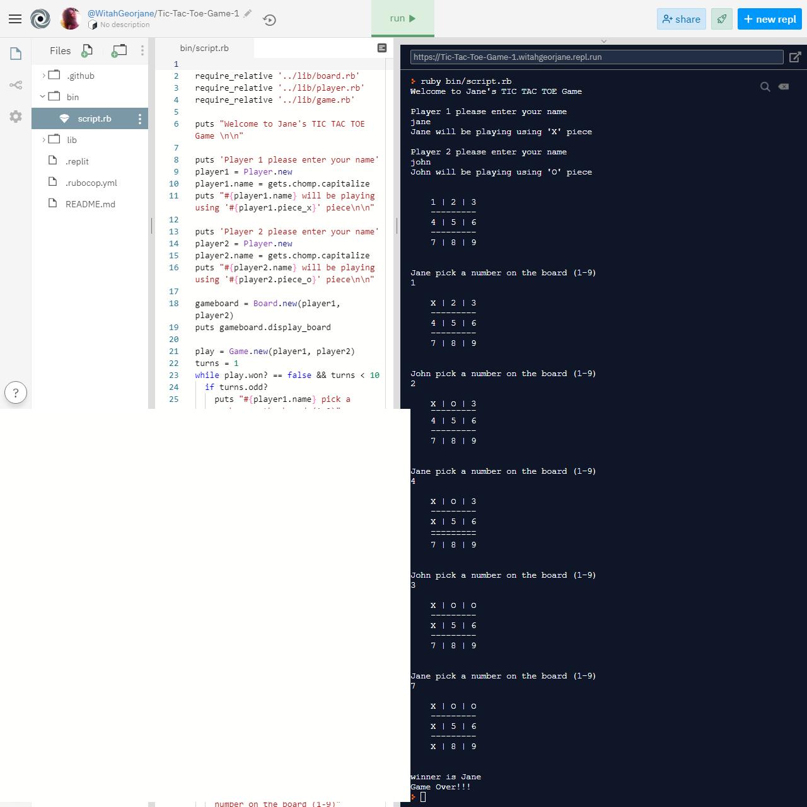

<h3 align="center">Tic Tac Toe Game in Ruby</h3>

<div align="center">

[]()
[](https://github.com/Georjane/Tic-Tac-Toe-Game/issues)
[](https://github.com/Georjane/Tic-Tac-Toe-Game/pulls)
[](/LICENSE)
[](https://github.com/Georjane)
[](https://twitter.com/WittyJany)

</div>

---

## 📝 Content
<p align="center">
<a href="#about">About</a>&nbsp;&nbsp;&nbsp;|&nbsp;&nbsp;&nbsp;
<a href="#installing">Installing</a>&nbsp;&nbsp;&nbsp;|&nbsp;&nbsp;&nbsp;
<a href="#play">How to Play</a>&nbsp;&nbsp;&nbsp;|&nbsp;&nbsp;&nbsp;
<a href="#built_using">Built with</a>&nbsp;&nbsp;&nbsp;|&nbsp;&nbsp;&nbsp;
<a href="#authors">Author</a>
</p>


## 🧐 About <a name = "about"></a>
<h3 align="center"> This is an assignment for the Microverse course. The goal of this project is to create a Tic Tac Toe game using the programming language Ruby. The game works inside the console. Each number (1 to 9) corresponds to a position on the board. When one of the players reaches a win condition (3 consecutive symbols - X or O ) the game says who the winner is.</h3>



---

## 🔧 Built with<a name = "built_using"></a>

- [Ruby](https://rubyonrails.org/)

## 🔴 Live Demo

[Live Demo](https://repl.it/join/xeigvvgb-witahgeorjane)

### 🛠 Installing <a name = "installing"></a>

### Pre-requisites

- Ruby installed on local machine. Please go to [this](https://www.ruby-lang.org/en/documentation/installation/) link if you need to install it.

### Usage

```
- Clone or download this repository;
- Unpack (if downloaded);
- On the command prompt or console type bin/main;
- The game will start and the players can play!

```

### 🛠 How to Play <a name = "play"></a>

```
- The first player will control the X pieces, the second player the O pieces
- The first player can choose from 1 to 9
- Those numbers correspond to a position in the board
- The second player can choose after from 1 to 9, but can't choose a place that already have a piece on it.
- The game goes until any player can have a sequence of 3 pieces (rows, columns or diagonals)
- Sometimes can be a draw!

- Good game and have fun!!!

```

### Rules

```
RULES FOR TIC-TAC-TOE
The game is played on a grid that's 3 squares by 3 squares.

You are X, your friend is O. Players take turns putting their marks in empty squares.

The first player to get 3 of her marks in a row (up, down, across, or diagonally) is the winner.

When all 9 squares are full, the game is over. If no player has 3 marks in a row, the game ends in a tie.

In this virtual implementation, you and your friend can place a mark by selecting from the numbers 1 to 9 when prompted. This is illustrated below:

| (1) | (2) | (3) |
| (4) | (5) | (6) |
| (7) | (8) | (9) |

A winning position would like the image below at the end. As soon as someone gets three of their marks in a row, the game ends.

| O | X | O |
| X | X | X | --- Player 'X' wins with this row!
| O | O | O |

For a detailed explanation, please have a look at this guide.
```

## Testing
### Install Rspec

```
$ gem install rspec
```
To test the code, run rspec from root of the folder using terminal as follows

```
rspec
```

Rspec is used for the test.

## ✒️  Author <a name = "author"></a>

👤 **Witah Georjane**

- Github: [@Georjane](https://github.com/Georjane)
- Twitter: [@WittyJany](https://twitter.com/WittyJany)
- Linkedin: [@witah-georjane](https://www.linkedin.com/in/witah-georjane-74b8bb184)

## 🤝 Contributing

Contributions, issues and feature requests are welcome!

Feel free to check the [issues page]https://github.com/Georjane/Tic-Tac-Toe-Game/issues).

## 👍 Show your support

Give a ⭐️ if you like this project!

## 📝 License

This project is free to use as learning purposes. For any external content (e.g. logo, images, ...), please contact the proper author and check their license of use.
